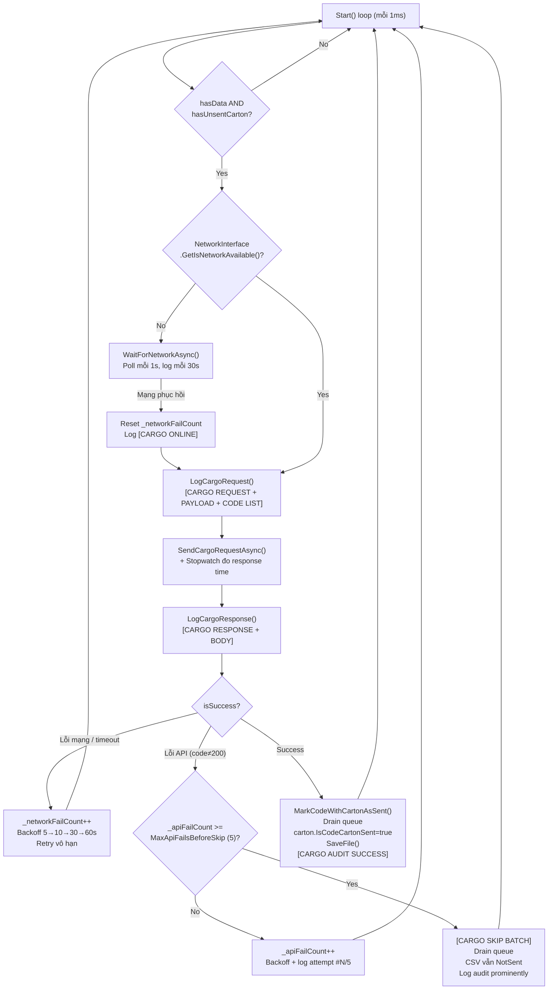

```mermaid
flowchart TD
    A["Start() loop (mỗi 1ms)"] --> B{"hasData AND\nhasUnsentCarton?"}
    B -- No --> A
    B -- Yes --> C{"NetworkInterface\n.GetIsNetworkAvailable()?"}
    C -- No --> D["WaitForNetworkAsync()\nPoll mỗi 1s, log mỗi 30s"]
    D -- "Mạng phục hồi" --> E["Reset _networkFailCount\nLog [CARGO ONLINE]"]
    E --> F
    C -- Yes --> F["LogCargoRequest()\n[CARGO REQUEST + PAYLOAD + CODE LIST]"]
    F --> G["SendCargoRequestAsync()\n+ Stopwatch đo response time"]
    G --> H["LogCargoResponse()\n[CARGO RESPONSE + BODY]"]
    H --> I{isSuccess?}
    I -- "Lỗi mạng / timeout" --> J["_networkFailCount++\nBackoff 5→10→30→60s\nRetry vô hạn"]
    J --> A
    I -- "Lỗi API &lpar;code≠200&rpar;" --> K{"_apiFailCount >=\nMaxApiFailsBeforeSkip &lpar;5&rpar;?"}
    K -- No --> L["_apiFailCount++\nBackoff + log attempt #N/5"]
    L --> A
    K -- Yes --> M["[CARGO SKIP BATCH]\nDrain queue\nCSV vẫn NotSent\nLog audit prominently"]
    M --> A
    I -- Success --> N["MarkCodeWithCartonAsSent()\nDrain queue\ncarton.IsCodeCartonSent=true\nSaveFile()\n[CARGO AUDIT SUCCESS]"]
    N --> A
```