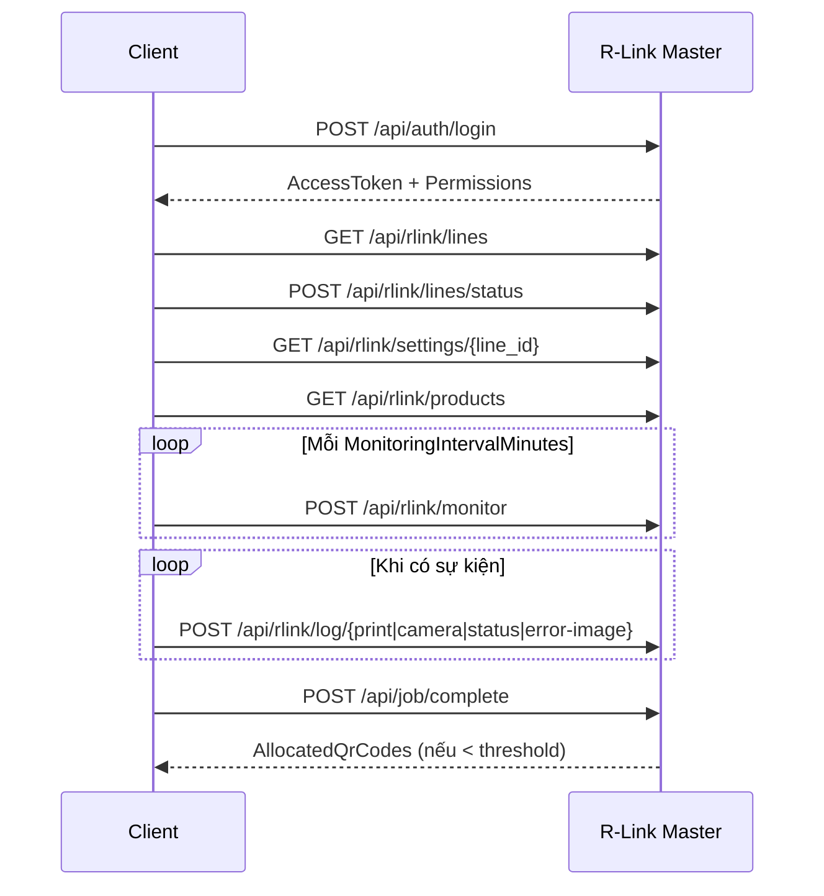

# 📘 R-Link Master API Reference

> **Project**: TH True Milk – Barcode Verification System
> **Server**: `RLinkMasterSimulator` (ASP.NET Core)
> **Client**: `BarcodeVerificationSystem` (.NET Framework 4.8 WinForms) — qua `IRLinkMasterService`
> **Base URL**: `http://<rlink-master-host>:<port>` (lấy từ `Shared.Settings.RLinkMasterUrl`)
> **Auth**: JWT Bearer (HS256). Header: `Authorization: Bearer <access_token>`
> **Content-Type**: `application/json; charset=utf-8`

---

## 📑 Mục lục
1. [Auth](#1-auth)
2. [R-Link Lines](#2-r-link-lines)
3. [Settings & Products](#3-settings--products)
4. [Monitor](#4-monitor)
5. [Logs](#5-logs)
6. [Job](#6-job)
7. [Health](#7-health)
8. [Simulator Utilities](#8-simulator-utilities)

---

## 1. Auth

### 1.1 `POST /api/auth/login` 🟢 Anonymous
Cấp `AccessToken` (24h) + `RefreshToken` (30 ngày) + permissions.

**Request**
```json
{ "username": "admin", "password": "admin123" }
```

**Response 200 — `LoginResult`**
```json
{
  "IsSuccess": true,
  "Username": "admin",
  "FullName": "Quản trị viên",
  "Role": "admin",
  "Message": null,
  "AccessToken": "eyJhbGciOiJIUzI1NiIs...",
  "RefreshToken": "eyJhbGciOiJIUzI1NiIs...",
  "Permissions": {
    "CreateJob": true,
    "DeleteJob": true,
    "Settings": true,
    "ProductionSettings": true
  }
}
```

**Response sai mật khẩu**
```json
{ "IsSuccess": false, "Message": "Sai tên đăng nhập hoặc mật khẩu." }
```

---

### 1.2 `POST /api/auth/refresh-token` 🟢 Anonymous
**Request**
```json
{ "refresh_token": "eyJhbGciOi..." }
```
**Response**: giống `LoginResult` (cấp lại cả 2 token). `401` nếu refresh token sai/hết hạn.

---

### 1.3 `GET /api/auth/accounts` 🔒 Bearer
**Response — `List<AccountInfo>`**
```json
[
  {
    "username": "admin",
    "full_name": "Quản trị",
    "role": "admin",
    "permissions": { "CreateJob": true, "DeleteJob": true, "Settings": true }
  }
]
```

---

## 2. R-Link Lines

### 2.1 `GET /api/rlink/lines?factory_code={code}` 🔒
Query `factory_code` optional.

**Response — `List<LineInfo>`**
```json
[
  {
    "factory_code": "F01",
    "factory_name": "Nhà máy Nghĩa Đàn",
    "line_id": "LINE-01",
    "line_name": "Line UHT 01",
    "line_ip": "192.168.1.50",
    "is_active": true
  }
]
```

---

### 2.2 `POST /api/rlink/lines/status` 🔒
Claim line + đăng ký IP máy. Reject nếu line đã được máy khác claim.

**Request**
```json
{ "line_id": "LINE-01", "factory_code": "F01", "line_ip": "192.168.1.100" }
```
**200 OK**
```json
{ "success": true, "line_id": "LINE-01", "line_ip": "192.168.1.100" }
```
**409 Conflict**
```json
{ "error": "Line đã được máy 192.168.1.99 sử dụng." }
```

---

### 2.3 `POST /api/rlink/lines/deactivate` 🔒
**Request**
```json
{ "line_id": "LINE-01", "factory_code": "F01" }
```
**200**: `{ "success": true, "line_id": "LINE-01" }` · **404** nếu line chưa active.

---

## 3. Settings & Products

### 3.1 `GET /api/rlink/settings/{line_id}` 🔒

**Response — `RLinkSettings`**
```json
{
  "OperatingMode": 2,
  "DeltaMinutes": 5,
  "NMinutes": 30,
  "BufferCount": 1000,
  "MonitoringIntervalMinutes": 1,
  "LogIntervalMinutes": 5,
  "QrThreshold": 50,
  "ErrorImageFolder": "C:\\R-Link\\ErrorImages",
  "RetentionDays": 180
}
```

| Field | Mô tả |
|---|---|
| `OperatingMode` | `1`=BatchOneQrCode · `2`=AutoRefreshByTime · `3`=ProductOneQrCode |
| `DeltaMinutes` | Phút reset trước midnight (Mode 1) — 1..15 |
| `NMinutes` | Chu kỳ đổi QR (Mode 2) |
| `BufferCount` | Số code/QR (Mode 2) |
| `QrThreshold` | Ngưỡng cảnh báo sắp hết QR |
| `RetentionDays` | Số ngày giữ log/job/ảnh (mặc định 180) |

---

### 3.2 `GET /api/rlink/products` 🔒

**Response — `List<ProductItem>`**
```json
[
  { "ProductId": "SP001", "ProductName": "TH True Milk 180ml" },
  { "ProductId": "SP002", "ProductName": "TH True Milk 110ml" }
]
```

---

## 4. Monitor

### 4.1 `POST /api/rlink/monitor` 🔒
Heartbeat. Tần suất theo `MonitoringIntervalMinutes`.

**Request — `MonitorPayload`**
```json
{
  "RLinkName": "R-Link-01",
  "LineId": "LINE-01",
  "IsPrinterConnected": true,
  "IsCameraConnected": true,
  "IsPlcConnected": false,
  "CurrentBatch": "B20260505-01",
  "TotalQrAllocated": 5000,
  "TotalQrUsed": 1234,
  "TotalQrFailed": 5,
  "TotalProduced": 1230,
  "LastErrorImageBase64": null,
  "Timestamp": "2026-05-05T14:30:00"
}
```

**Response**: `{ "success": true }`

---

## 5. Logs

> Tất cả endpoint log: 🔒 Bearer · Response `{ "success": true }` · Server tự gán `timestamp` nếu client để default.

### 5.1 `POST /api/rlink/log/print` — `LogPrintPayload`
```json
{
  "line_id": "LINE-01",
  "job_name": "20260505_113000_Mode2_B001_SP001",
  "batch": "B001",
  "status": "Run",
  "qr_used": 12,
  "produced": 12000,
  "timestamp": "2026-05-05T11:35:00"
}
```
| `status` | `Start` · `Run` · `Stop` |

---

### 5.2 `POST /api/rlink/log/camera` — `LogCameraPayload`
```json
{
  "line_id": "LINE-01",
  "rlink_name": "R-Link-01",
  "job_name": "Job_xxx",
  "batch": "B001",
  "product_id": "SP001",
  "product_name": "TH True Milk 180ml",
  "rlink_status": "Running",
  "operator_user": "operator1",
  "camera_ok": 11990,
  "camera_fail": 10,
  "timestamp": "2026-05-05T11:35:00"
}
```
> `total_check` = `camera_ok + camera_fail` (computed read-only).

---

### 5.3 `POST /api/rlink/log/status` — `LogStatusPayload`
Dùng cho `NotifyDeviceException` (PrinterDisconnected, CameraDisconnected, PlcDisconnected, **QrStockLow**).

```json
{
  "line_id": "LINE-01",
  "rlink_name": "R-Link-01",
  "job_name": "Job_xxx",
  "batch": "B001",
  "product_id": "SP001",
  "product_name": "TH True Milk 180ml",
  "status": "running",
  "rlink_status": "QrStockLow: Mode 2 QR stock low: 30/50 | consumed=120",
  "operator_user": "operator1",
  "qr_used": 100,
  "produced": 100000,
  "timestamp": "2026-05-05T11:35:00"
}
```
| `status` | `start` · `running` · `stop` · `completed` · `error` |

> Đẩy qua `pending_logs` SQLite + retry tự động (`RLinkLogRetrySenderService`).

---

### 5.4 `POST /api/rlink/log/error-image` — `ErrorImagePayload`
```json
{
  "line_id": "LINE-01",
  "job_name": "Job_xxx",
  "batch": "B001",
  "qr_code": "TH123456789",
  "image_base64": "iVBORw0KGgoAAAANSUhEUgAA...",
  "timestamp": "2026-05-05T11:35:00"
}
```

---

### 5.5 `GET /api/rlink/log/recent` 🔒 (debug)
```json
{
  "camera": [ /* 50 LogCameraPayload mới nhất */ ],
  "print":  [ /* 50 LogPrintPayload */ ],
  "status": [ /* 50 LogStatusPayload */ ]
}
```

---

## 6. Job

### 6.1 `POST /api/job/complete` 🔒
Báo job hoàn thành & cấp QR mới nếu kho thấp.

**Allocation logic**:
- `remaining = QrTotalAllocated - QrUsedCount`
- nếu `remaining < QrThreshold` → cấp `(QrThreshold - remaining) + max(BufferCount, 1)` mã QR
- format: `{PREFIX}_{yyMMddHHmmss}_{seq:D5}` — PREFIX = `JobName.ToUpper()` (loại space)

**Request — `CompleteJobRequest`**
```json
{
  "JobName": "20260505_113000_Mode2_B001_SP001",
  "RLinkName": "R-Link-01",
  "QrUsedCount": 4800,
  "QrTotalAllocated": 5000,
  "ProducedCount": 4795,
  "OperatingMode": 2,
  "BufferCount": 1000
}
```

**Response — có cấp thêm**
```json
{
  "IsSuccess": true,
  "Message": "Hoàn thành job thành công. Cấp 1050 QR mới (còn 200, ngưỡng 50).",
  "AllocatedQrCodes": [
    "JOB_260505113000_00001",
    "JOB_260505113000_00002"
  ]
}
```

**Response — không cần cấp**
```json
{
  "IsSuccess": true,
  "Message": "Hoàn thành job thành công. Không cần cấp QR mới (còn 500 ≥ ngưỡng 50).",
  "AllocatedQrCodes": []
}
```

---

## 7. Health

### 7.1 `GET /api/health` 🟢 Anonymous
```json
{ "status": "ok", "timestamp": "2026-05-05T14:30:00" }
```

---

## 8. Simulator Utilities

> ⚠️ Chỉ tồn tại trong `RLinkMasterSimulator` để test.

| Method | Endpoint | Mô tả |
|---|---|---|
| `GET` | `/api/sim/qrbank/status` | Trạng thái kho QR ảo |
| `POST` | `/api/sim/qrbank/generate?count=N&prefix=P` | Sinh N mã QR (1..100,000) |
| `DELETE` | `/api/sim/qrbank/clear` | Xóa kho QR |
| `POST` | `/api/sim/push/batch` | Push batch QR sang R-Link client |
| `GET / PUT` | `/api/sim/settings` | Đọc/ghi `RLinkSettings` ảo |
| `GET / POST / PUT / DELETE` | `/api/sim/accounts[/{username}]` | CRUD account test |
| `GET` | `/api/sim/logs?count=N` | Log nội bộ simulator |
| `DELETE` | `/api/sim/logs` | Clear log |

### 8.1 `POST /api/sim/push/batch`
```json
{
  "RLinkIp": "192.168.1.100",
  "RLinkPort": 5002,
  "FactoryCode": "F01",
  "LineId": "LINE-01",
  "LineName": "Line UHT 01",
  "Batch": "B001",
  "Count": 100,
  "BearerToken": null
}
```
**Response**
```json
{ "ok": 95, "duplicates": 3, "fail": 2, "remaining": 9905 }
```

> Flow: simulator tự `POST /api/qrbank/login` (`qrbank/qrbank@#062026`) → nhận token → `POST /api/qrbank/data` từng mã.

---

## 🔑 Ghi chú quan trọng

- **JWT secret** mặc định: `RLinkMasterSimulator_JWTSecret_2026!!` (override `appsettings.json` → `Jwt:Secret`)
- **Offline cache**: log gửi qua `RLinkLogService.AddPendingLog()` → SQLite → `RLinkLogRetrySenderService` retry
- **`StoreCredentials`** (client): cho phép `TryRestoreAuthAsync` re-login khi token hết hạn
- **`DeviceExceptionType.QrStockLow`** → `POST /api/rlink/log/status` với cooldown 10 phút
- **QrBank local server** (client-side): `http://*:5002/` — nhận push từ simulator

---

## 📊 Sequence Diagram

